# XWorm – Malware Triage

This is a full triage of one malware sample. This repo shows everything I did, in order, with screenshots and diagrams. For each step I write what I did, why I did it, and what it means.

Everything ran inside a safe lab. The sample never touched the real internet or my real computer.

---

## Verdict

**Malicious. This is a Remote Access Trojan (RAT), most likely XWorm.**

A RAT lets an attacker control your machine from far away. They can run commands, steal files, watch the screen, and more.

The sample was tagged `AsyncRAT` on MalwareBazaar. AsyncRAT and XWorm are close .NET RAT families. They act in similar ways. The behaviour and the command server point to XWorm. I could not read the final config string to prove the exact family by name, because the last stage was obfuscated. I explain that at the end. The command server was confirmed two different ways, so the verdict is solid.

## Quick facts

| Item | Value |
|------|-------|
| File type | Windows .NET executable (PE32, 32-bit, .NET Framework 4.7.2) |
| SHA256 | `0AF84CC7993EB64D51A1CE695C43749E1635B5040F17D6CAE1DA4B574DC88658` |
| MD5 | `2BAC31A29BE8885E900083AEBB6C2CAD` |
| SHA1 | `DD108B8A271095BCF42AB3C69F57D9A229B33373` |
| Command server (C2) | `217.195.153.81:50000` |
| Persistence | Scheduled task that runs at logon |
| Dropped copy | `C:\Users\<user>\AppData\Local\Local Studio\` |
| Family | XWorm (RAT). Tagged AsyncRAT on MalwareBazaar. |

- Full indicator list: [`iocs/indicators.csv`](iocs/indicators.csv)
- Blocklist: [`iocs/blocklist.txt`](iocs/blocklist.txt)
- ATT&CK mapping: [`notes/mitre.md`](notes/mitre.md)

## Words you need to know

I use some terms a lot. Here they are in plain words.

| Word | Plain meaning |
|------|---------------|
| Sample | The malware file I am studying. |
| RAT | Remote Access Trojan. Malware that lets an attacker control your PC from far away. |
| C2 | Command and Control. The attacker's server. The malware calls it for orders. |
| Beaconing | The malware calls the C2 again and again, on a timer, to say "I am alive". |
| Persistence | How malware stays on the machine after a reboot. |
| Dropper / Loader | The first file. Its job is to set things up and start the real malware. |
| Payload / Stage 2 | The next, hidden piece of malware that the loader unpacks. |
| LOLBin | "Living off the land binary". A normal, trusted Windows tool that malware abuses. |
| Sandbox | A safe, watched machine where you can run malware without harm. |
| Process hollowing | A trick where malware hides its code inside a normal running program. |
| Obfuscation | Making code hard to read on purpose, to slow down analysts. |
| IOC | Indicator of Compromise. A clue (like a hash or an IP) that means "this is bad". |
| Hash | A fingerprint of a file. Same file = same hash. |

## Tools I used

| Tool | What it is for |
|------|----------------|
| VMware + FLARE-VM | The safe lab. A throwaway Windows machine with analysis tools. |
| ANY.RUN | Cloud sandbox. Runs the file online and shows what it does. |
| Procmon | Shows which program starts which program, and file activity. |
| Wireshark | Shows the network traffic. |
| dnSpy | Reads the .NET code. The sample is a .NET file. |

---

## The attack at a glance

This is the whole attack in one picture. The details come later, step by step.

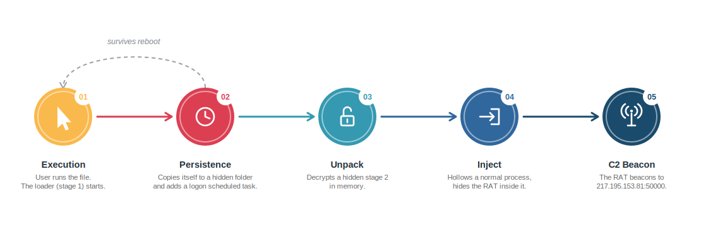

## How I worked

I looked at the sample in two ways. Both matter, and they back each other up.

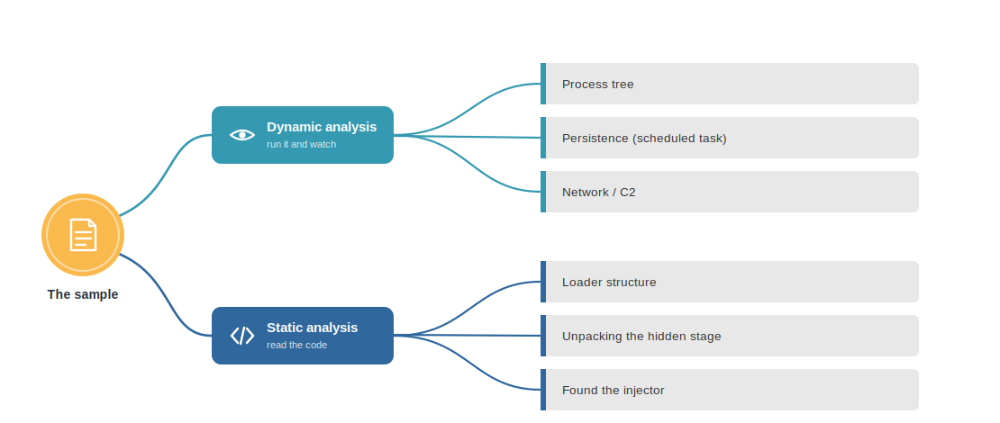

Dynamic analysis means I run the malware and watch what it does. Static analysis means I read the code without running it. The code tried to hide a lot. Running it forced it to show its real behaviour. Reading the code showed me how it works inside. Together they give the full picture.

## How to read this repo

The steps go in order. Steps 1–3 are setup. Steps 4–8 are dynamic analysis. Steps 9–15 are static analysis. Then the verdict, the limits, detection ideas, and a short summary.

---

# Part 1 – Setup

## Step 1 – Get the sample

I downloaded the sample from MalwareBazaar. MalwareBazaar is a site that shares real malware for research.

It came as a zip with the password `infected`. Malware is always shared password-locked and zipped. There are two reasons. First, it stops the file from running by accident. Second, it stops antivirus from deleting it before I can study it.

The file inside was a .NET executable. The first thing I did was write down the hashes (SHA256, MD5, SHA1, see the table above). A hash is a fingerprint of the file. I save it for three reasons. It lets me prove later that the file I ran is the exact same file. It lets other people look the sample up. And it is the most basic indicator (IOC) for this threat.

## Step 2 – Quick check in a cloud sandbox

Before I touched the file myself, I ran it in ANY.RUN. ANY.RUN is a cloud sandbox. It runs the file on their machine, not mine, and shows what it does.

Why do this first? It is fast and safe. It gives me a first idea of what I am dealing with before I spend time on my own lab. If the sample was broken or boring, I would know in a minute.

In ANY.RUN I could already see the sample start, unpack the zip, and make network requests. It looked like a RAT.

One important habit I used here: telling noise from signal. Most of the network requests were normal Windows traffic (Microsoft update, telemetry, certificate checks). Only one connection really mattered, the one to the attacker's server. A long list looks scary, but most of it is normal. The skill is to find the one line that matters and ignore the rest.

Note: the free ANY.RUN plan makes your report public, and it only runs a 32-bit Windows. That is fine for a first look.

## Step 3 – Build a safe lab

Then I built my own lab so I could look closer than the cloud lets me.

I used VMware with FLARE-VM. A virtual machine (VM) is a computer that runs inside my computer, in a window. If it gets infected, my real machine is safe. FLARE-VM is a Windows machine packed with malware analysis tools. I installed Windows 10 Pro inside the VM (not Home), because Pro has tools I need, like Defender policy settings.

Before running the malware I did three things. Each one matters.

1. **Network set to host-only.** This means the VM can only talk to my host, not the real internet. So the malware cannot reach its real server, and it cannot spread. When it tries to call home, it hits a dead end (or a fake server I control).
2. **Took a snapshot.** A snapshot is a saved clean state of the VM. After I run the malware, the machine is dirty. I roll back to the snapshot to get a clean machine again. I did this after every single run. This is the most important safety habit.
3. **Set up a fake network and traffic capture.** I used a fake internet tool and Wireshark, so I could see what the malware tried to send out.

(Side note: I also disabled some host features like VBS/Hyper-V so VMware would run faster. That is a host tuning detail, not part of the malware.)

---

# Part 2 – Dynamic analysis (run it and watch)

## Step 4 – Find jsc.exe in System Informer

Back in the cloud sandbox (Step 2), one small detail stood out: the malware had started a program called `jsc.exe`. It is easy to lose a line like that in a long list, but it looked out of place, so I wanted to confirm it on my own machine.

So as soon as I ran the sample in my lab, I had System Informer open and went looking for it. System Informer (the tool that used to be called Process Hacker) is like Task Manager, but it shows much more: the full process tree, which program started which, and the user each one runs under. It is one of the first tools I open when I watch a live sample.

There it was. `jsc.exe` (PID 5544) was running, started during the infection, under my own user. Around it you can also see my lab: `fakenet.exe`, the tool that pretends to be the internet so the malware gets an answer when it tries to call out, and System Informer itself.

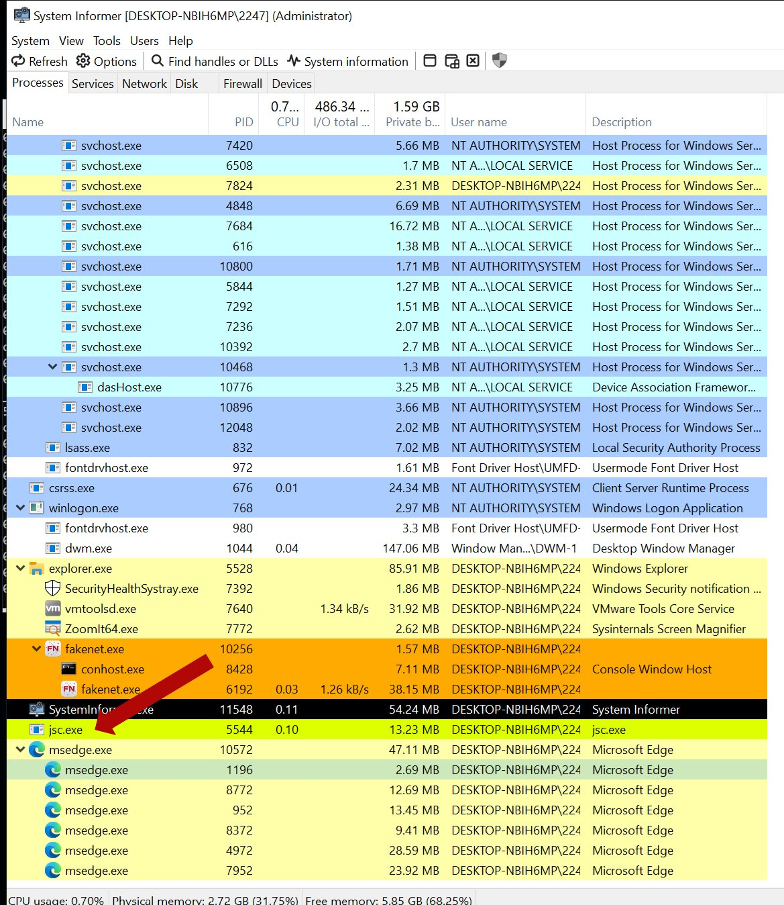

That confirmed on my own machine what the cloud had shown. Now I wanted the full picture of which program starts which. That is the next step.

## Step 5 – Run it and watch the processes

I ran the sample and watched it with Procmon. Procmon records what programs do on the machine. The most useful view is the **process tree**. It shows which program starts which program.

A small problem first. Procmon shows everything on the whole machine. That is tens of thousands of events per second. It froze. So I set a filter. I told Procmon to only show the malware and `Process Create` events. After that it was fast. The lesson: filter first, or you drown in noise.

Here is the process tree I built from the data:

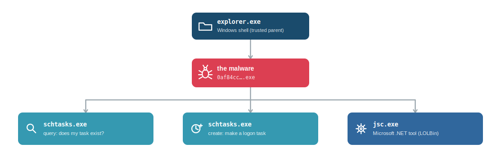

This already tells me a lot. `schtasks.exe` makes scheduled tasks. `jsc.exe` is a Microsoft .NET tool. Both are normal Windows programs. The malware uses them on purpose. It looks less suspicious, and it does not need to bring its own tools.

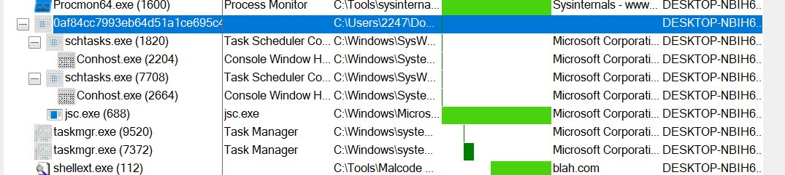

## Step 6 – How it stays after reboot

I asked one question: why does it run `schtasks.exe` twice? I clicked the events and read the command lines.

The answer is a check, then an action. Here is the logic:

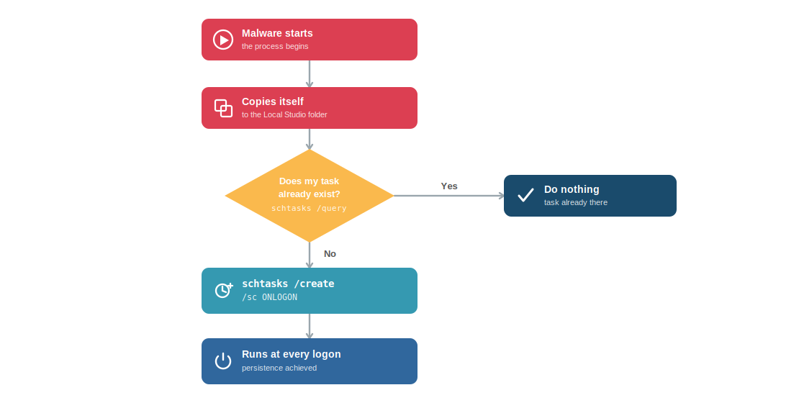

The first call checks if the task already exists (`/query`). If yes, it does nothing. If no, it makes the task (`/create`). This is tidy. It avoids making the task twice.

Here is the create command line I found:

```
schtasks.exe /create /sc ONLOGON /tn "SystemHealthMonitor" /tr "...a copy of itself..."
```

`/sc ONLOGON` means the task runs every time a user logs on. So the malware comes back after a reboot. That is its persistence.

The task name was `SystemHealthMonitor`. In the cloud sandbox the name was `UserSessionManager`. So the name is not fixed. I note both names, but I do not trust the name alone as an indicator.

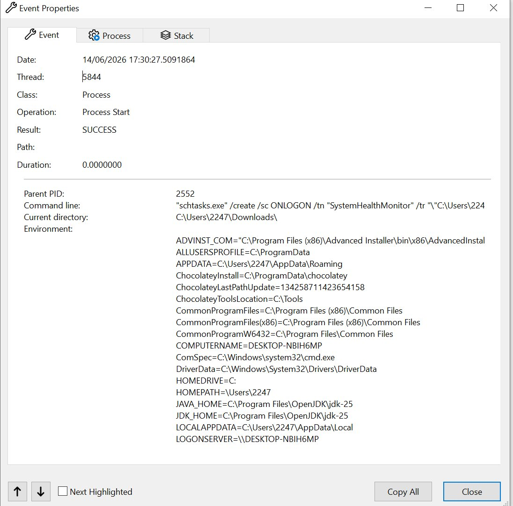

I also opened Task Scheduler to confirm with my own eyes. The task is there. It runs "At log on of any user", with the highest privileges. Now I have proof from three sources that all agree: the process tree, the command line, and Task Scheduler. Three sources agreeing is much stronger than one.

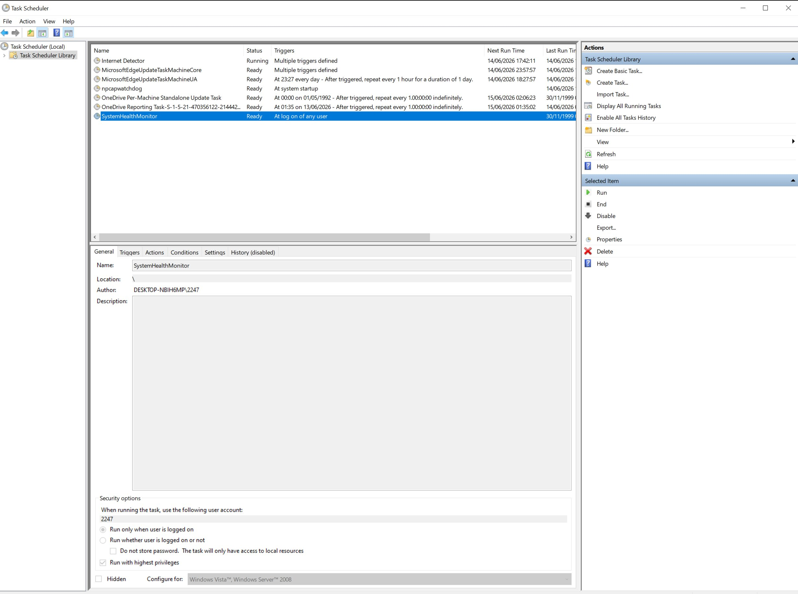

## Step 7 – It copies itself to a hidden folder

I noticed the task does not point to the file in my Downloads folder. It points to a copy. The malware copies itself here:

```
C:\Users\<user>\AppData\Local\Local Studio\
```

The folder name "Local Studio" looks normal on purpose. So a copy of the malware sits in that folder and runs at every logon. Even if you delete the file you downloaded, this copy stays. This is the file the persistence task actually starts. It is an important indicator (a "dropped file").

In the code I later found the part that does this copy. It also picks the persistence method based on whether it runs as admin or as a normal user. So it adapts. That is not lazy malware.

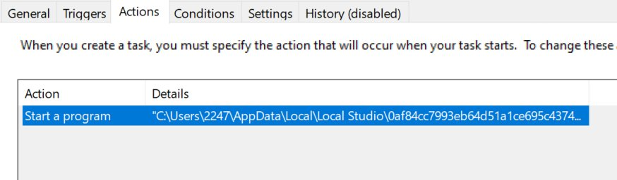

## Step 8 – It uses built-in Windows tools

I also checked the `jsc.exe` it started. The command line shows the path:

```
C:\Windows\Microsoft.NET\Framework\v4.0.30319\jsc.exe
```

This is the real Microsoft JScript.NET compiler. It is a trusted, signed Windows file. Malware uses trusted files like this so antivirus and analysts trust them too. The trick has a name: "living off the land". The malware leans on tools that are already on the machine, so it brings less of its own code.

So now I have seen two of these tricks: `schtasks.exe` for persistence, and `jsc.exe` to run code.

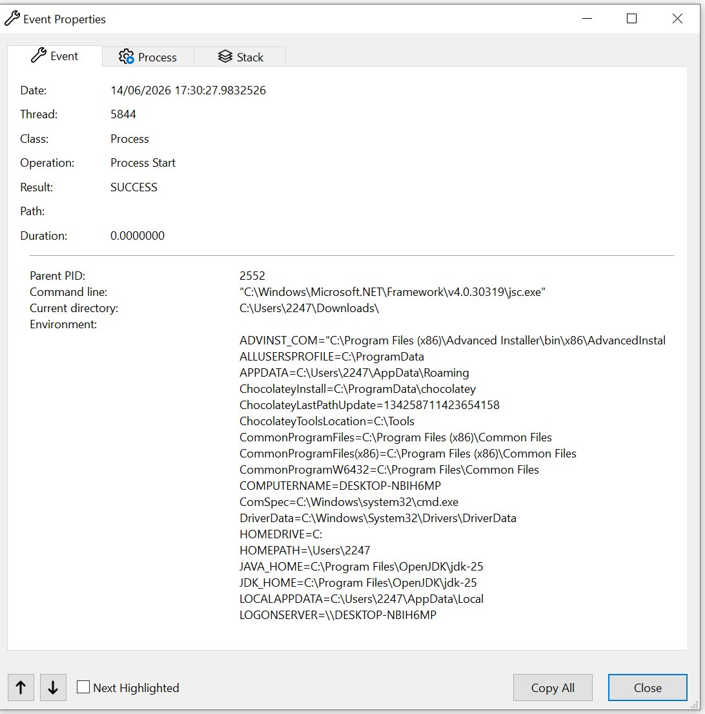

## Step 9 – It talks to a server (C2)

Now the network. I captured the traffic with Wireshark and filtered on the port. You can see my VM (`192.168.194.128`) talking to `217.195.153.81` on port `50000`.

Here is what that conversation looks like:

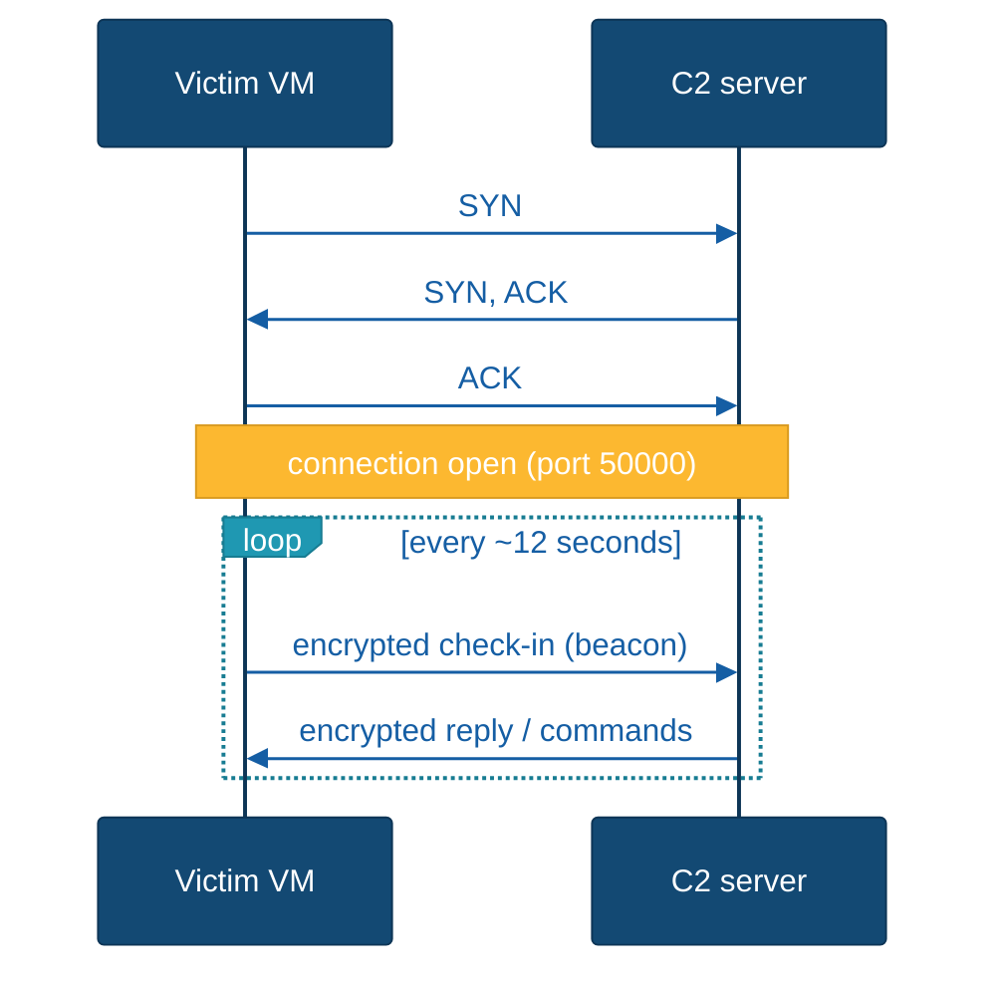
```mermaid
%%{init: {'theme':'base','themeVariables':{'actorBkg':'#134973','actorBorder':'#0d3556','actorTextColor':'#ffffff','signalColor':'#155EA4','signalTextColor':'#155EA4','labelBoxBkgColor':'#1F98B2','labelBoxBorderColor':'#177c92','labelTextColor':'#ffffff','loopTextColor':'#155EA4','noteBkgColor':'#FCB830','noteBorderColor':'#d99a1f','noteTextColor':'#ffffff'}}}%%
sequenceDiagram
    participant V as Victim VM
    participant C as C2 server
    V->>C: SYN
    C->>V: SYN, ACK
    V->>C: ACK
    Note over V,C: connection open (port 50000)
    loop every ~12 seconds
        V->>C: encrypted check-in (beacon)
        C->>V: encrypted reply / commands
    end
```

First a normal TCP handshake (SYN, SYN-ACK, ACK). That opens the connection. Then `PSH, ACK` packets over and over. Those repeating packets are the malware checking in with its server and waiting for orders. This is beaconing. It happens about every 12 seconds (look at the times in the capture: 539, 551, 563, 575). The packet sizes change because each message is a different command or reply.

The data is encrypted, so I cannot read the content. I noted that too: "C2 traffic on 217.195.153.81:50000, encrypted." But I can prove the connection. This is the command server (C2).

Now the C2 is confirmed two ways: in ANY.RUN, and here in my own capture. That is strong evidence.

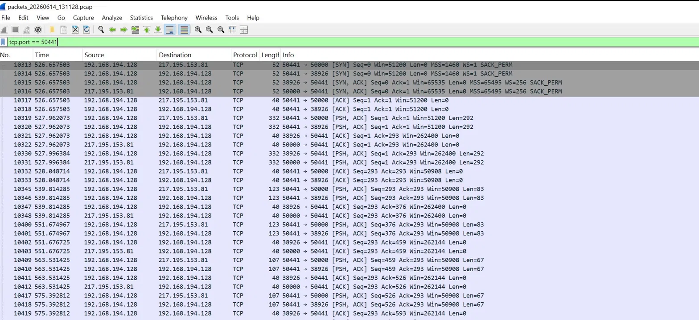

---

# Part 3 – Static analysis (read the code)

At this point I already had the verdict and the C2. The next part was to look inside the file and understand how it works. This was the hardest part.

The file is not one simple program. It is built in layers (stages). Here is the shape of it, which I worked out step by step:

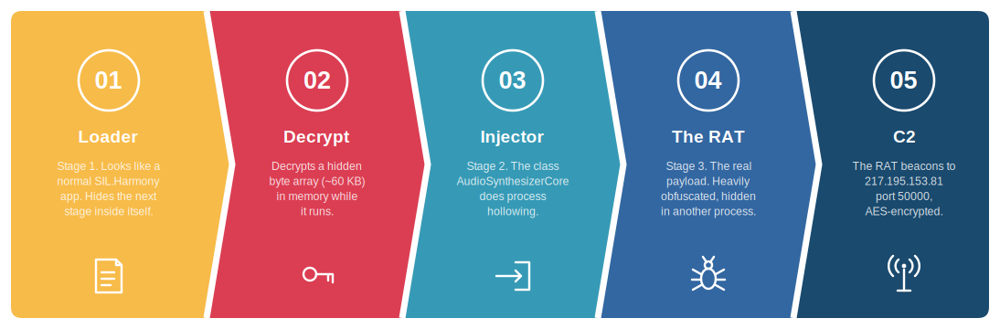

Stage 1 is the file I downloaded. It hides stage 2 inside itself, encrypted. Stage 2 is an injector. It hides stage 3 (the real RAT) inside a normal process. I reached stage 2. Stage 3 was locked behind heavy obfuscation.

## Step 10 – Look inside the file

I opened the file in dnSpy. dnSpy turns .NET files back into readable C# code.

The file pretends to be a normal app. It has fake info:
- fake title: "magnetic retentiveness"
- fake company: "the Southern Triangle"
- fake product: "waist-deep"

The code also borrows class names from a real open source library (`SIL.Harmony`). The main code even looks like a harmless demo of that library. All of this is camouflage. It makes the file look like any random normal app, so simple rules do not flag it.

This taught me something. The normal-looking starting code (`Main`) was a decoy. The real malware did not run from there. So I had to look in other places. When the front door is fake, look at what runs automatically and at the one piece that does not fit.

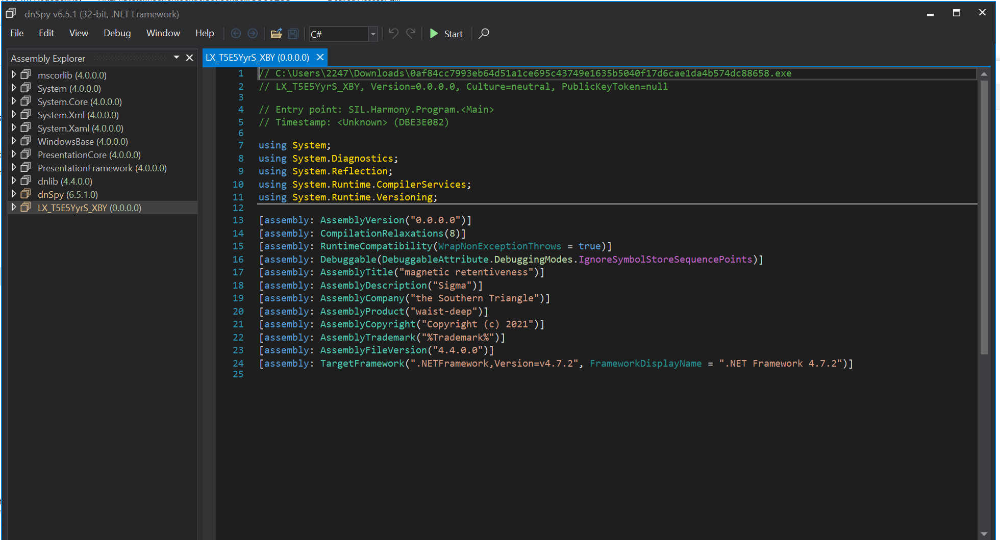

## Step 11 – The C2 is not in the code (in plain text)

I searched the code for the port `50000`. I expected to find the C2 address written somewhere.

I got nothing useful. Only normal .NET framework results.

This empty result is a finding by itself. It means the C2 is not stored in plain text. It is stored encrypted or hidden, and it gets decrypted in memory when the file runs. That is exactly why I saw it in the traffic but not in the code. So the real malware code must be hidden somewhere and unpacked while it runs.

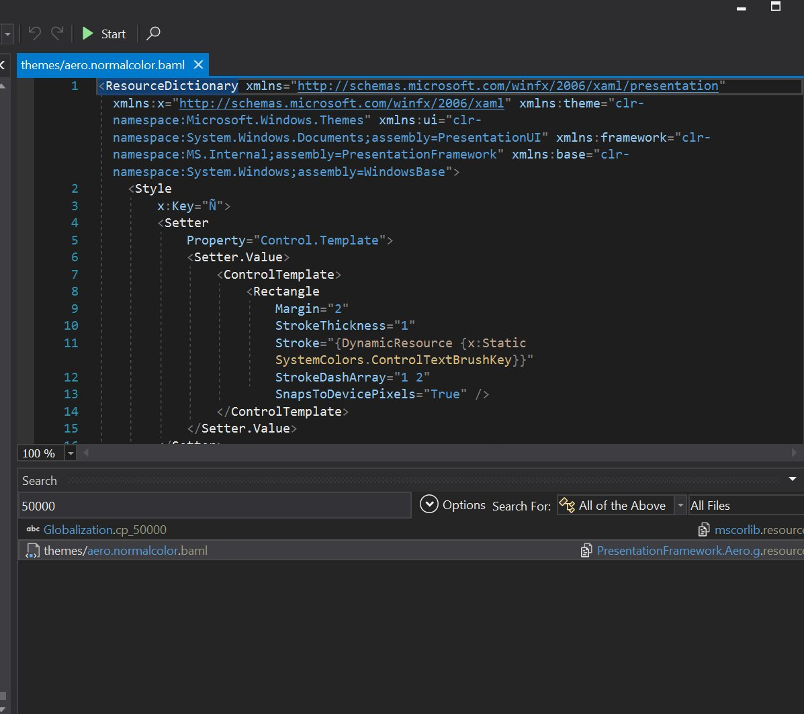

## Step 12 – Find where it loads the hidden code

So my new goal: find the spot where it unpacks and loads the hidden part.

The C2 is encrypted, but the code that loads the hidden part is not. So I searched for the .NET function that loads code from memory: `Assembly.Load`. Then I used dnSpy's "Analyze" feature. It shows who calls a function ("Used By"). This is like following a trail backwards.

The trail went like this:
- `Assembly.Load` is called by `DefaultAdapter.Load`
- which is called by a method called `AddRangeFromSync`

So `AddRangeFromSync` is where the hidden code gets loaded. The code reads a byte array, decrypts it, and loads it as a new program in memory. It then grabs classes from a part called `AudioSynthesizerCore` (another fake name). So the real malware lives in there, inside that encrypted byte array.

I also read the part that does the persistence (a class with a generic name, `EnvironmentOrchestrator`). The code matched exactly what I saw earlier in Procmon. It checks the privilege level, builds the `schtasks` command, makes the logon task, and then deletes its own temporary file afterwards to leave less trace. Seeing the code and the live behaviour match is the whole point of doing both kinds of analysis.

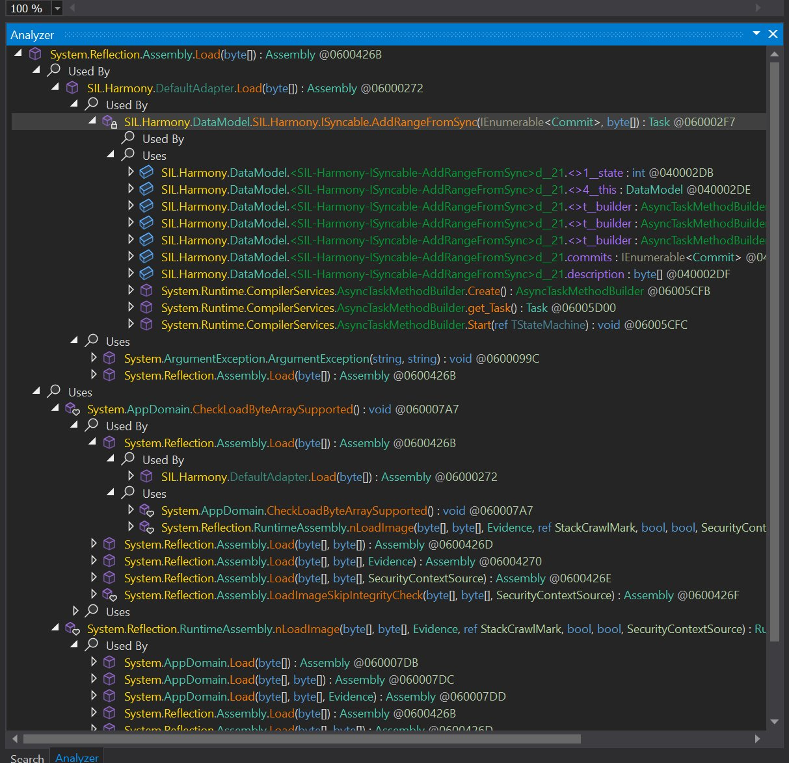

## Step 13 – Catch the hidden code in memory

Reading the decryption by hand was too messy. So I used the debugger instead.

The plan was simple:

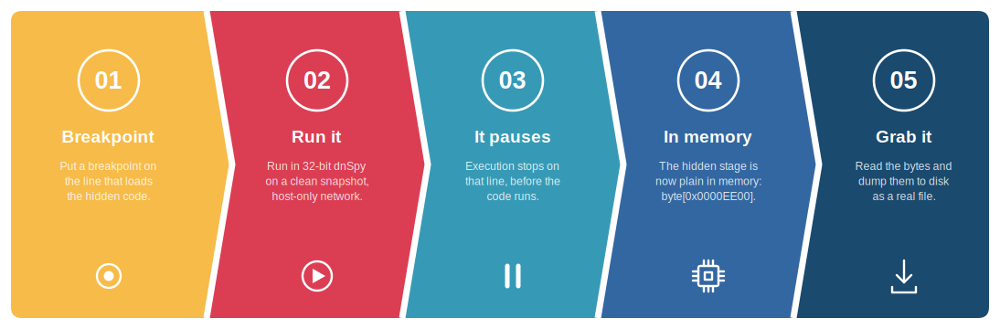

A breakpoint is a "pause here" marker. When the program reaches that line, it freezes. At that exact moment, the hidden code is already decrypted and sitting in memory, ready for me to take.

A small problem: the file is 32-bit, and I first used the 64-bit dnSpy. It gave an error ("use 32-bit dnSpy"). So I switched to the 32-bit dnSpy. I did all of this on a clean snapshot, with host-only network, because running it means the malware runs for real.

It worked. The breakpoint hit. In the variables panel I could see the hidden data as a byte array: `description = byte[0x0000EE00]`. That is about 60,000 bytes, frozen in memory. This is the decrypted second stage.

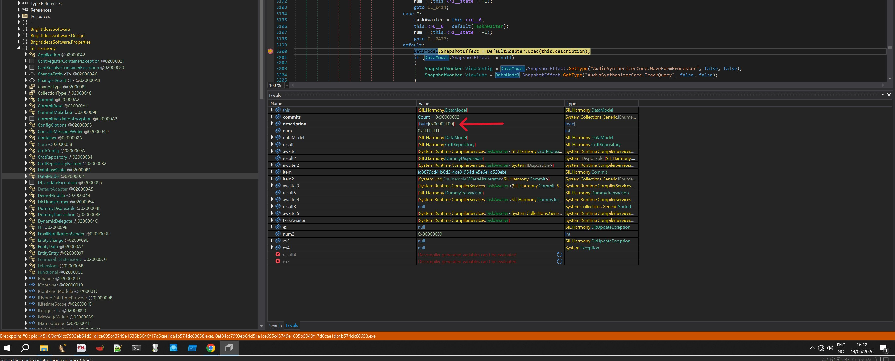

## Step 14 – Dump the hidden code to disk

While it was frozen on the breakpoint, I looked at the bytes in the memory view. The first two bytes were `4D 5A` (`MZ`). `MZ` means it is a Windows program file. I also saw the text "This program cannot be run in DOS mode". That text is in every Windows program. So I knew I had a real second-stage file, not random data.

I saved those bytes to disk as a file. This is called dumping. I now had the hidden payload as a real file I could open.

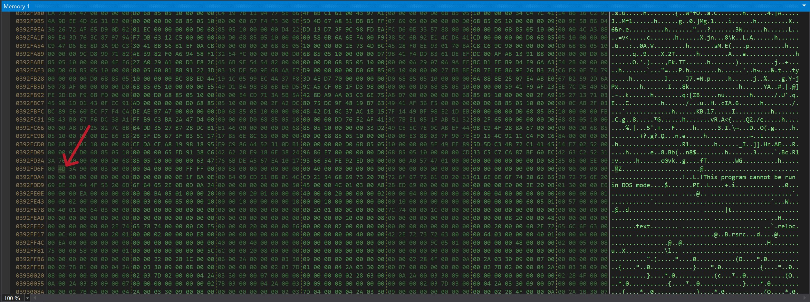

## Step 15 – The real payload is an injector

I loaded my dumped file back into dnSpy. It opened as a real .NET file. The real code lives in `AudioSynthesizerCore`.

But it is not the RAT itself. It is an injector. It does process hollowing. Here is what process hollowing means:

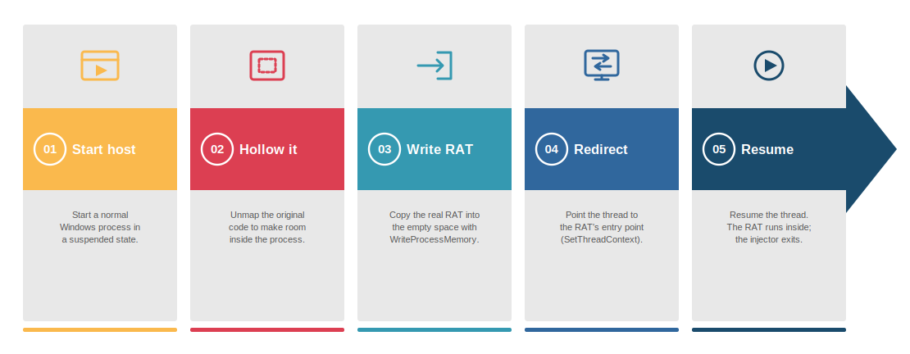

The class names give it away: things like `MEM_COMMIT`, `PAGE_EXECUTE_READWRITE`, and `IMAGE_NT_HEADERS`. Those are the building blocks for putting code into another process.

This also explains something I saw earlier. The malware process disappeared from the task list after a while. That is because it injected the RAT into another process and then closed itself. The real RAT keeps running inside that other process. So a simple "is the bad file still running?" check would miss it.

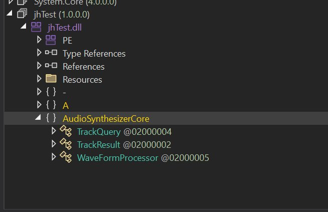

## Step 16 – The wall: heavy obfuscation

I wanted to go one more step and read the final config (the C2 and the key) straight from the code. Here I hit a wall.

The stage was heavily obfuscated. All the class names were random text (long hex strings), hundreds of them. The strings were encrypted too. This is done on purpose, to stop people like me from reading it.

So I stopped here. Fully unpacking this is a much bigger job. It needs special deobfuscation tools and a lot more time. It is its own project, not part of a first triage.

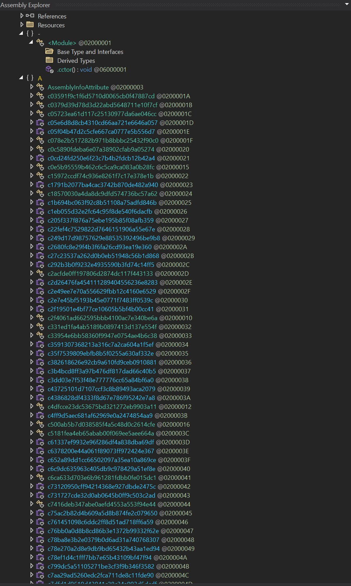

---

## What I could not finish (and why it is okay)

I could not read the C2 and the key straight from the code. The last stage was obfuscated, so the names and strings were hidden.

This does not hurt the verdict. I already had the C2 confirmed two ways: from ANY.RUN and from my own Wireshark capture. And I mapped the whole chain: the loader, the persistence, the memory unpacking, and the process-hollowing injector.

It also proves the point of dynamic analysis. The code tried to hide everything. But when I ran it in a safe lab, it had to show its real behaviour: the scheduled task, the dropped file, and the call to its server. Running it beat the camouflage. This is a normal and honest place to stop a first triage.

## Detection ideas (for defenders)

If I worked on a blue team, here is how I would catch this. These come straight from what I saw.

| What to look for | Why it works |
|------------------|--------------|
| A scheduled task set to "at logon" that points to a file in `AppData\Local` | Normal apps rarely do this. The malware does. |
| `jsc.exe` started by a user program from a Downloads or AppData folder | `jsc.exe` is rarely used like this in normal life. |
| `schtasks.exe /create /sc ONLOGON` started by a random .exe | This is the persistence step in the act. |
| A new file in a folder named like "Local Studio" under `AppData\Local` | This is the dropped copy. |
| Outbound TCP to `217.195.153.81` on port `50000` | This is the C2. Block it. |
| Steady beaconing to one IP every ~12 seconds | The timing pattern is a strong sign of a RAT. |

The hashes and the C2 are ready to block in [`iocs/blocklist.txt`](iocs/blocklist.txt).

## The full chain, in short

1. The user runs the file.
2. The file makes a scheduled task so it survives reboot (`SystemHealthMonitor`, at logon).
3. The file copies itself to `AppData\Local\Local Studio`.
4. It uses trusted Windows tools (`schtasks.exe`, `jsc.exe`) to hide.
5. It decrypts a hidden second stage in memory and loads it.
6. The second stage is an injector. It hides the real RAT inside another process.
7. The RAT beacons to `217.195.153.81:50000` (encrypted).

## Cleanup

After each run I rolled the VM back to a clean snapshot. The malware leaves a scheduled task that would start it again at the next logon, so the machine has to be reset.

## Files in this repo

| Path | What it is |
|------|------------|
| `README.md` | This writeup. |
| `images/` | The screenshots, in step order. |
| `iocs/indicators.csv` | All indicators (hashes, C2, paths, task names). |
| `iocs/blocklist.txt` | The C2 and hash, ready to block. |
| `notes/mitre.md` | The MITRE ATT&CK mapping. |
