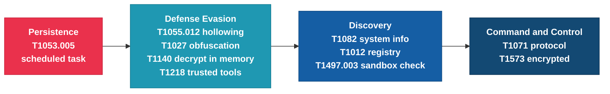

# MITRE ATT&CK mapping

These are the techniques I saw in this sample. Each one links to what I found in the triage.

## The attack by phase

This shows the techniques in the order they happen on the victim machine.

## The full list

| Tactic | Technique | ID | What I saw |
|--------|-----------|----|-----------|
| Persistence / Execution | Scheduled Task | T1053.005 | Makes a task that runs at logon (`SystemHealthMonitor`) |
| Defense Evasion | Process Injection: Process Hollowing | T1055.012 | Second stage injects the RAT into another process |
| Defense Evasion | Obfuscated Files or Information | T1027 | Fake names, borrowed library names, packed/obfuscated stages |
| Defense Evasion | Deobfuscate/Decode Files or Information | T1140 | Decrypts the second stage in memory at runtime |
| Defense Evasion | System Binary Proxy / Trusted Tools | T1218 / T1127 | Abuses `schtasks.exe` and `jsc.exe` (signed Windows tools) |
| Command and Control | Application Layer Protocol | T1071 | Beacons to the C2 over TCP |
| Command and Control | Encrypted Channel | T1573 | C2 traffic is AES-encrypted |
| Discovery | System Information Discovery | T1082 | Seen in sandbox behaviour |
| Discovery | Query Registry | T1012 | Seen in sandbox behaviour |
| Defense Evasion | Virtualization/Sandbox Evasion: Time Based | T1497.003 | Seen in sandbox behaviour |

Note: the discovery and sandbox-evasion items (T1082, T1012, T1497.003) came from the
dynamic sandbox run. The persistence, injection, and obfuscation items I confirmed myself
in dnSpy and Procmon.
